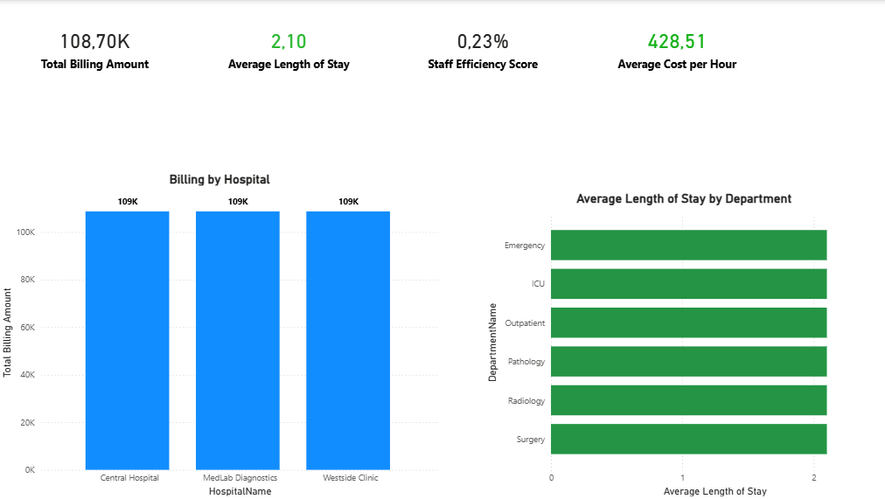
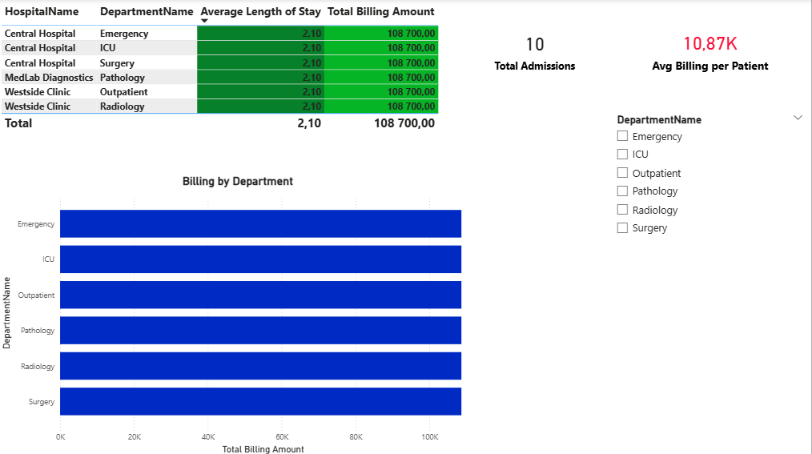
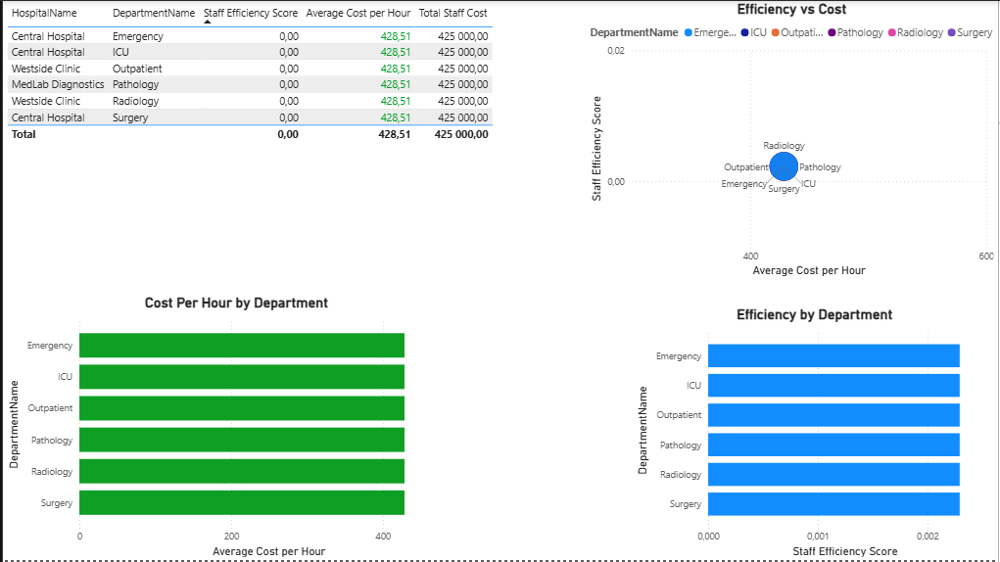

# 🏥 Healthcare Operations & Revenue Analytics  
### Power BI | SQL Server | DAX  

## 📌 Project Overview
This project delivers an **end-to-end healthcare analytics solution** focused on:

- Operational cost control  
- Patient revenue performance  
- Department efficiency  
- Length of stay optimisation  

The goal is to simulate how a **hospital CFO and operations team** monitor cost, efficiency, and billing performance across departments.

This project is part of a **family office–style, long-term CFO preparation portfolio**, demonstrating financial oversight, KPI governance, and operational analytics.

---

## 🗄️ Data Model
The model integrates:

- Operational Cost  
- Patient Operations  
- Staff Efficiency  
- Department & Hospital Dimensions (ID-based relationships)  

A **mapped department key architecture** was implemented to resolve mixed ID/name schemas and enable a proper star model in Power BI.

---

# 📊 Power BI Dashboards

## 1️⃣ Executive Overview
**Purpose:** High-level hospital performance monitoring

### KPIs (Cards)
- 🟢 Average Length of Stay → **Green** (below 7 days target)  
- 🟢 Average Cost per Hour → **Green** (≤ 500 threshold)  

### Visuals
- **Bar Chart:** Average Length of Stay by Department (all green)  
- **Bar Chart:** Billing Amount by Hospital  
- Clean performance across departments  

---

## 2️⃣ Cost & Efficiency Analysis
**Purpose:** Department-level cost control and billing performance

### Visuals
- **Table:**  
  - Average Length of Stay → 🟢 Green  
  - Total Billing Amount → 🟢 Green  
- **Department Slicer** for drill-down analysis  

📊 Insight:  
- Length of stay maintained **below 7 days** across departments  
- Billing performance consistent across departments  

---

## 3️⃣ Department Performance
**Purpose:** Identify cost drivers and efficiency opportunities

### Visuals
- **Bar Chart:** Cost per Hour by Department → 🟢 All ≤ 500  
- **Bar Chart:** Efficiency by Department  
- **Scatter Plot:** Cost vs Efficiency positioning  
- **Table:** Average Cost per Hour by Department (clean performance)

📊 Insight:  
- All departments operating within cost thresholds  
- Clear efficiency distribution across departments  

---

# 🎯 Key Business Insights
- ✅ Length of stay controlled below operational risk threshold  
- ✅ Department cost per hour within target range (≤ 500)  
- ⚠️ Average billing per patient below target (revenue optimisation opportunity)  
- ✅ Consistent billing across departments  
- 📉 No cost outliers detected  

---

# 🧠 CFO-Level Capabilities Demonstrated
- KPI governance with conditional formatting thresholds  
- Cost containment monitoring  
- Revenue performance diagnostics  
- Operational efficiency benchmarking  
- Star schema modelling with surrogate keys  
- Executive-ready dashboard design  

---

# 🛠️ Tools & Technologies
- SQL Server (Data modelling & analytical views)  
- Power BI (Dashboards & DAX measures)  
- DAX (Efficiency, cost, and revenue KPIs)  

---

# 📂 Repository Structure
# 👤 Author
**Boiketlo Thabang Lorekang**  
📊 Aspiring CFO | Data Analytics | Financial Strategy  

🔗 GitHub: https://github.com/BoiketloTLorekang  
🔗 LinkedIn: https://www.linkedin.com/in/boiketlo-lorekang-931337241
